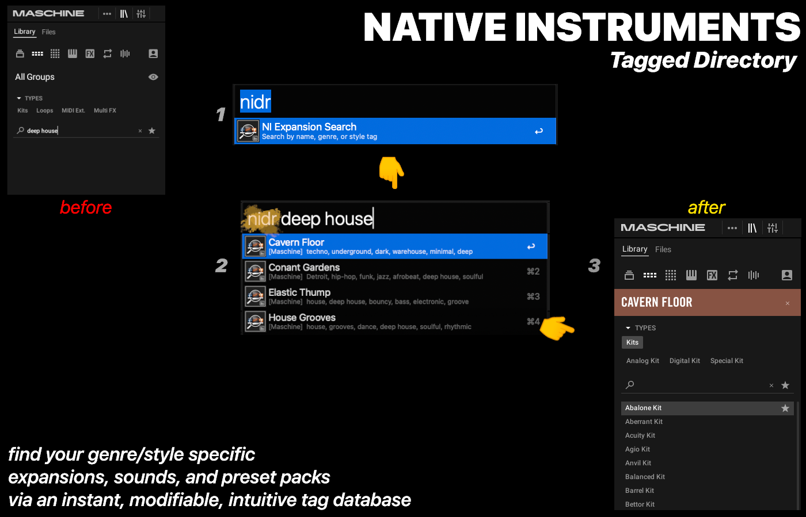

# NI Directory

Search your installed [Native Instruments](https://www.native-instruments.com/) expansions by name, genre, or style tags — from [Alfred](https://www.alfredapp.com/) or the terminal.



## Features

- **Instant search** — type `nidr` followed by any keyword to filter expansions by name, genre, or style
- **Type labels** — see at a glance whether an expansion is for Maschine, Kontakt, Massive X, Leap, or other platforms
- **Recent history** — your last 5 selections appear at the top (★) when you open `nidr` with no query
- **Auto-setup** — on first run, scans your installed NI products and builds a local expansion list
- **Curated tags database** — 150+ expansions tagged with genres and styles
- **Ignore list** — automatically filters out NI instruments, libraries, and factory content so only expansions appear
- **Copy to clipboard** — press Enter to copy an expansion name
- **Large type** — press Cmd+L for a full-screen view with all tags

## Installation

### CLI (no Alfred required)

```bash
git clone https://github.com/micro-JAY/ni-directory.git
cd ni-directory
./install-cli.sh
```

The install script symlinks `nidr` to `/usr/local/bin/`. If that fails (permissions), it offers to add a shell alias instead.

**Requirements:** macOS, Python 3 (included with macOS)

### Alfred Workflow

1. Download the latest `NI-Directory.alfredworkflow` from [Releases](../../releases)
2. Double-click to install in Alfred
3. Type `nidr` — the workflow will auto-detect your installed expansions on first run

**Requirements:** Alfred 5 with Powerpack, macOS, Python 3 (included with macOS)

## Usage

### CLI

| Command | Description |
|---|---|
| `nidr` | Show recents, then all expansions |
| `nidr funk` | Find all funk-tagged expansions |
| `nidr techno dark` | Multi-word search (matches all terms) |
| `nidr leap` | Filter by expansion type |
| `nidr --refresh` | Rescan installed NI products |
| `nidr --help` | Show help |

Output is colored in the terminal and automatically plain when piped, so `nidr | fzf` just works.

### Alfred

| Command | Description |
|---|---|
| `nidr funk` | Find all funk-tagged expansions |
| `nidr techno dark` | Multi-word search (matches all terms) |
| `nidr leap` | Filter by expansion type |
| `nidr massive x` | Find all Massive X expansions |
| `nidr !refresh` | Rescan installed NI products |

Just typing `nidr` with no query shows your recently selected expansions first, then all installed expansions.

## How It Works

Native Instruments stores product metadata at `/Users/Shared/Native Instruments/installed_products/`. On first run (or when you use `nidr !refresh`), the workflow:

1. Scans that directory for installed products
2. Cross-references against the curated `tags_database.json`
3. Filters out non-expansion products using `ignore_list.json`
4. Generates a local `expansions.json` with only your installed expansions

Your local `expansions.json` and `recents.json` are gitignored — they're personal to your setup.

## Contributing

### Adding missing expansions

If the workflow shows an expansion with "(tags unavailable)", it means it's installed but not yet in the tags database. To add it:

1. Fork this repo
2. Add an entry to `src/tags_database.json`:
   ```json
   "Expansion Name": {
     "tags": "genre1, genre2, style1, style2, descriptive keywords",
     "type": "Maschine"
   }
   ```
   Valid types: `Maschine`, `Kontakt`, `Massive X`, `Leap`, `Artist`, `Play Series`
3. Submit a PR

### Updating the ignore list

If a non-expansion product (instrument, library, factory content) is showing up in results:

1. Add its exact name to `src/ignore_list.json`
2. Submit a PR

## File Structure

```
cli/
└── nidr.py              # CLI entry point
src/
├── search.py            # Alfred search logic + auto-setup
├── tags_database.json   # Curated genre/style tags (152 expansions)
├── ignore_list.json     # NI products to exclude (instruments, libraries)
├── info.plist           # Alfred workflow configuration
└── icon.png             # Workflow icon
install-cli.sh           # CLI installer (symlink or alias)
```

Generated locally (gitignored):
- `expansions.json` — your installed expansions (built from tags_database + scan)
- `recents.json` — your recently selected expansions

## License

MIT — see [LICENSE](LICENSE)


TONARI LABS

